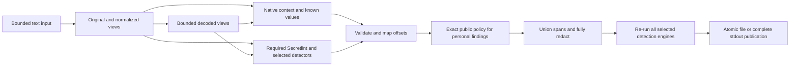

# Issue #1: a reliable sensitive-text sanitization foundation

[Issue #1](https://github.com/link-foundation/sensitive-data-sanitizer/issues/1) requests consolidation of sanitization practices across four repository owners, a library/framework/CLI, contextual credentials, nuanced public-person/contact handling, competitor research, language/service coverage, optional Git-history remediation, and a detailed executed plan in one PR. The initial repository contained an arithmetic template and release pipeline, with no sensitive-text API. There were no issue comments or PR discussion/review comments at initial inspection.

The implementation combines independently maintained scanning with native context rules, exact known values, Unicode projection, bounded decoded views, unioned offset spans, and a required residual scan. It preserves existing arithmetic exports, CLI and universal app. Package metadata now names the sanitizer, with a Changesets release trigger and no manual version bump.

## Requirements, decisions and evidence

| ID  | Requirement                                                                                   | Solution and executed plan                                                                                                                                       | Verification / remaining boundary                                                                                                  |
| --- | --------------------------------------------------------------------------------------------- | ---------------------------------------------------------------------------------------------------------------------------------------------------------------- | ---------------------------------------------------------------------------------------------------------------------------------- |
| R1  | Investigate every repository of link-foundation, linksplatform, link-assistant and konard     | Paginated owner inventories and per-owner indexed sanit/redact code searches; preserve URL/path/blob metadata                                                    | 172, 88, 29 and 1,444 owned repositories; indexed search is not an exhaustive content audit                                        |
| R2  | Thoroughly study hive-mind, formal-ai and documents-processing                                | Inspect credential/publication modules, CI scanning, personal spelling variants and history rewrite design; inspect recent related PRs                           | [Repository findings](REPOSITORY-RESEARCH.md) and source hashes; no raw private incident inputs republished                        |
| R3  | Collect existing logic/best practices                                                         | Use known-secret dictionaries, scanner union, bounded patterns/decoding, safe metadata, residual verification, private atomic files, history snapshot audit      | Native tests, actual Secretlint rules and local external-tool experiments                                                          |
| R4  | Library/framework and CLI for logs, AI sessions and text                                      | ESM exports/types; required async detector contract; redact/scan/history commands; strict JSON config                                                            | Library/CLI integration tests, examples and package smoke test                                                                     |
| R5  | Personal names/emails and related data                                                        | Labelled/literal detection, email/phone/card/IP/SSN validators and optional real Presidio NER bridge                                                             | Multilingual labels and codepoint/byte mapping tests; unlabelled names need a configured model/dictionary                          |
| R6  | Preserve public people/orgs/organization-published email appropriately                        | Explicit exact PERSON/ORGANIZATION/EMAIL policy with HTTPS evidence and review date; caller determines context                                                   | Public name/email tests; credential overlap always wins; automatic popularity inference is excluded                                |
| R7  | All contextual credentials including short passwords                                          | Assignment/JSON/escaped JSON/XML/CLI/query/auth/cookie/URL/PEM recognition and known literals                                                                    | Low-entropy, truncated-key and syntax-boundary tests; arbitrary unknown labels/formats need extension                              |
| R8  | Reliability and competitor algorithms                                                         | Required pinned Secretlint default; optional real Gitleaks/TruffleHog/Presidio union; Gitleaks/TruffleHog/detect-secrets/Presidio/generic offset report adapters | [Competitor matrix](COMPETITORS.md); complete spans, failure/residual blocking, bounded limits; no universal competitive guarantee |
| R9  | Closed-source documentation/features                                                          | Review Google, Azure, AWS and GitGuardian primary docs; explicit offset adapter supports caller-obtained reports                                                 | Conversion tests after emoji/non-ASCII; no automatic cloud upload or claim to reproduce proprietary models                         |
| R10 | Many natural languages and their specifics                                                    | 17 credential label variants, multilingual PII labels, Unicode normalization/control handling; configurable installed NER language/model                         | Exact coverage table and regression fixtures; label coverage is distinguished from semantic multilingual NER                       |
| R11 | Many popular service formats                                                                  | 26 native service rule families plus maintained upstream rules and optional installed detector sets                                                              | Provider fixtures and actual binary runs; future changes require updates and regression data                                       |
| R12 | Optional careful history redaction/editing                                                    | Read-only reachable/reflog object audit and reviewed git-filter-repo remediation procedure                                                                       | Deleted-file and author-metadata audit test; refs unchanged; remote erasure is separate                                            |
| R13 | Deep case study, external facts, existing components, solution plans and execution in this PR | Plan, source inventory/search snapshots, design, competitor/requirements matrix and reproducible experiments                                                     | [Execution plan](PLAN.md), [validation](VALIDATION.md), and this PR's CI evidence                                                  |

“Fully sanitize any text” and “beat exactly all competitors” cannot be certified by a finite test suite. The same unlabelled string may be public prose in one setting and a password in another; detectors need policy/context to distinguish them. Proprietary models are not reproducible from documentation alone. The concrete reliability contract is that selected detection engines are required, their valid findings are unioned, every detected value is masked in full, and all those engines must succeed on final output. This contract makes failures explicit without presenting heuristic detection as a universal guarantee.

## Root causes and resolved regressions

The template had no detector or sanitization entry point; the first minimum regression failed importing `createSanitizer`. Implementation then exposed specific reliability defects through experiments and tests:

- TruffleHog reports a decoded Raw value for base64 input. Matching only original literals incorrectly rejected its report. The adapter now maps supported decoded values to entire original capsules, with a test and an actual binary rerun.
- Invalid ranges from a detector on an encoded view could trigger masking without validating that report. Every engine result is now validated against its exact view before source mapping.
- A URL-scheme regex retried an unbounded letter run at every character. A bounded 1 MiB probe exposed quadratic behavior. A scheme-boundary assertion prevents repeated starts; the regression preserves long identifiers and still masks userinfo.
- Overlapping single-word and full-name label hits prevented keeping an exact approved multiword public name. Personal prose now produces the complete labelled value, and the public-name regression passes.
- Known dictionaries were initially compared to normalized text without applying the same projection to their values. The dictionary regression now passes for literal and obscured values; original matching is retained as well.
- An empty TruffleHog record could be treated as a clean result, and impossible calendar dates could pass public-policy validation. Both inputs now fail validation, with reproducing tests.
- The optional Presidio bridge was initially exposed only through the API. CLI flags now select the required local bridge, interpreter, installed model and language; the actual model experiment verifies both entry points.
- Adding Node scanner imports to the original root entry broke the existing Vite example build (`node:net`'s `isIP` was unavailable in the browser). A browser arithmetic entry and direct example import preserve the template UI. Browser-condition package resolution has a regression test, and the existing web/desktop build workflows verify the actual bundling.
- The repository's initial security CI failed because Dependency Review reported an unsupported/disabled dependency graph. Logs were downloaded before intervention. Enabling repository vulnerability alerts restored the dependency comparison API; new CI runs verify the result. This was repository configuration, not a sanitizer test failure.

## Architecture

Native synchronous methods share the detector/offset logic but do not invoke asynchronous upstream scanners. Private file reads reject symlinks and invalid encoding; publication uses a new private temporary file. CLI scan reports and errors omit input text. Required engine failures are never interpreted as a clean scan.

## Evidence and scope

Research was collected on 2026-10-07. All owner inventories use pagination and filter actual ownership. Initial combined searches capped at 100 matches were broadened to per-owner searches capped at 1,000; every final query returned fewer than that cap. API rate limits were handled by waiting and retrying individual pages. GitHub indexing, forks, default-branch coverage, inaccessible repositories and search terms still limit completeness. The study does not claim that every blob in every repository was read.

The research directory contains repository inventories, indexed search metadata, the issue snapshot, selected source path/blob hashes and recent related PR metadata. Live sources are linked next to each finding. The collection script is `experiments/collect-sanitization-research.mjs`; raw third-party secrets/log payloads are deliberately absent from the committed dataset.

The implemented profile is UTF-8 text. Compression/encryption/OCR, structured-data type preservation, remote retention guarantees, every national ID validator, all languages/models, proprietary feature parity and an independent market-wide benchmark remain outside demonstrated coverage. [Coverage](../../COVERAGE.md) documents these boundaries and the extension contract. The competitor matrix supplies concrete follow-on acceptance criteria where the broader aspiration exceeds the demonstrated profile.
